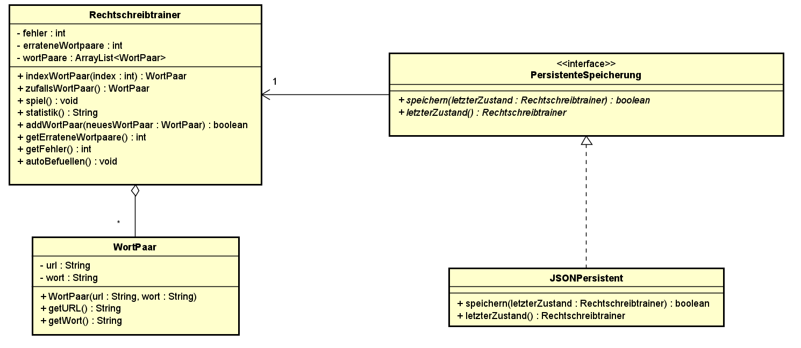

In diesem Projekt wird eine Rechtschreibsoftware für Volksschulkinder entwickelt.
Den Kindern werden verschiedene Bilder gezeigt und zu jedem Bild müssen sie das passende Wort
korrekt hinschreiben. Hat ein Kind das passende Wort zum Bild geschrieben, so wird ein neues Bild
angezeigt. Des Weiteren gibt es eine fortlaufende Statistik, sodass das Kind sehen kann wie viele korrekte
Wörter es geschrieben hat und wie viele Fehlversuche es hat. 

Nach einer Session wird der Zustand des Rechtschreibtrainers (bestehend aus den zur Verfügung stehenden 
Wort-Bild-Paaren, dem aktuell ausgewählten Paar (falls vorhanden) sowie der aktuellen Statistik) 
gespeichert. Des Weiteren soll die Speicherstrategie austauschbar sein.

Das zugehörige UML sieht wie folgt aus:

Um die Austauschbarkeit, der Speicherstrategie zu gewährleisten, habe ich ein Strategy Pattern 
eingebaut. Möchte man statt JSON in XML speichern, muss man nur eine eigene Klasse erstellen 
und keinen Code ändern. 

Das Interface persistenzeSpeicherung verwendet 1 Rechtschreibtrainer Objekt. Aus diesem Grund 
hat es eine Assoziation mit Rechtschreibtrainer.

Der Rechtschreibtrainer hat eine Aggregation zu WortPaar, da der Rechtschreibtrainer eine ArrayList 
aus Wortpaaren hat, welcher er benötigt, um die Spiellogik zu implementieren. 

Errors:

Beim Versuch die Methode Runde aufzurufen, hatte ich kurzzeitig ein StackOverflow, da ich versuche
in getWort() getWort() returne, was dazu führt, dass sie sich unendlich oft aufruft.

Der Fehler ist aufgetreten, weil ich in der Rechtschreibtrainer Klasse ein JSONPersistent Objekt
bereits hatte und ich in der Main ein eigenes extra aufgerufen habe.